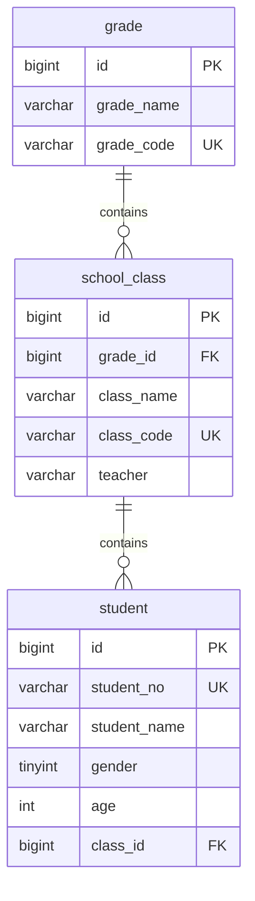

# Vibedent - 学生管理系统 🎓

> ⚡ 本项目 **完全由 AI 驱动开发**：所有代码、文档（包括这个README）及提交记录均由 **Claude Code + DeepSeek** 自动生成，无人工编写。

## 🚀 技术栈

- **语言**: Java 17+
- **框架**: Spring Boot 3.x
- **构建工具**: Maven
- **数据库**: MySQL 8.0
- **AI 驱动**: Claude Code + DeepSeek-v4

## 📦 项目结构

```
xsglxt/
├── src/main/java/com/akira/xsglxt/
│   ├── XsglxtApplication.java          # Spring Boot 入口
│   └── controller/
│       └── HelloController.java        # Hello World 控制器
├── src/main/resources/
│   └── application.yaml                # 应用配置
├── .mcp.json                           # MCP 服务器配置
├── pom.xml                             # Maven 依赖管理
└── README.md
```

## 🗄️ 数据库设计

### 表关系



### 表说明

| 表名       | 说明             |
| ---------- | ---------------- |
| `grade`    | 年级表           |
| `class`    | 班级表，关联年级 |
| `student`  | 学生表，关联班级 |
| `sys_user` | 系统用户表       |

## 🛠️ 快速开始

### 环境要求

- JDK 17+
- Maven 3.8+
- MySQL 8.0+

### 1. 克隆项目

```bash
git clone https://github.com/mayoi-Akira/Vibedent.git
cd Vibedent
```

### 2. 配置数据库

编辑 `src/main/resources/application.yaml`，修改数据库连接信息。

### 3. 运行项目

```bash
./mvnw spring-boot:run
```

## 🤖 AI 开发声明

| 项目       | 说明                               |
| ---------- | ---------------------------------- |
| 开发工具   | Claude Code (VS Code 扩展)         |
| AI 模型    | DeepSeek-v4-pro                    |
| 数据库管理 | Claude Code MCP + MySQL MCP Server |
| 版本控制   | Git + GitHub，所有提交由 AI 生成   |

---

_README generated by Claude Code & DeepSeek-v4-pro on 2026-06-03_
