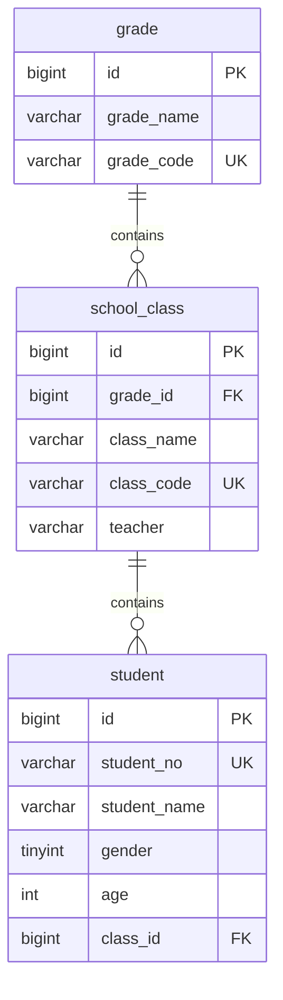

# Vibedent - 学生管理系统 🎓

> ⚡ 本项目 **完全由 AI 驱动开发**：所有代码、文档（包括这个README）及提交记录均由 **Claude Code + DeepSeek** 自动生成，无人工编写。

## 🚀 技术栈

### 后端

| 技术             | 版本          |
| ---------------- | ------------- |
| Java             | 17+           |
| Spring Boot      | 4.0.6         |
| MyBatis-Plus     | 3.5.16        |
| MySQL            | 8.0           |
| Maven            | 3.8+          |
| Lombok           | latest        |

### 前端

| 技术             | 版本          |
| ---------------- | ------------- |
| Vue              | 3.x           |
| Vite             | latest        |
| Pinia            | latest        |
| Vue Router       | latest        |
| Axios            | latest        |

### 开发工具

| 技术             | 说明                        |
| ---------------- | --------------------------- |
| AI 驱动          | Claude Code + DeepSeek-v4   |

## 📦 项目结构

### 后端 (Spring Boot)

```
xsglxt/
├── src/main/java/com/akira/xsglxt/
│   ├── XsglxtApplication.java              # Spring Boot 入口
│   ├── common/
│   │   └── Result.java                     # 统一响应格式 {data, msg}
│   ├── config/
│   │   ├── CorsConfig.java                 # CORS 跨域配置
│   │   └── MybatisPlusConfig.java          # MyBatis-Plus 配置（分页插件）
│   ├── controller/
│   │   ├── HelloController.java            # Hello World
│   │   ├── StudentController.java          # 学生管理接口
│   │   ├── ClassInfoController.java        # 班级管理接口
│   │   └── GradeController.java            # 年级管理接口
│   ├── entity/
│   │   ├── Student.java                    # 学生实体
│   │   ├── ClassInfo.java                  # 班级实体
│   │   ├── Grade.java                      # 年级实体
│   │   └── SysUser.java                    # 系统用户实体
│   ├── exception/
│   │   └── GlobalExceptionHandler.java     # 全局异常处理
│   ├── mapper/
│   │   ├── StudentMapper.java              # 学生 Mapper
│   │   ├── ClassInfoMapper.java            # 班级 Mapper
│   │   └── GradeMapper.java                # 年级 Mapper
│   └── service/
│       ├── StudentService.java             # 学生服务接口
│       ├── ClassInfoService.java           # 班级服务接口
│       ├── GradeService.java               # 年级服务接口
│       └── impl/
│           ├── StudentServiceImpl.java     # 学生服务实现
│           ├── ClassInfoServiceImpl.java   # 班级服务实现
│           └── GradeServiceImpl.java       # 年级服务实现
├── src/main/resources/
│   ├── application.yaml                    # 应用配置
│   └── static/
├── pom.xml                                 # Maven 依赖管理
└── README.md
```

### 前端 (Vue 3 + Vite)

```
frontend/
├── src/
│   ├── api/
│   │   ├── request.js              # Axios 请求封装
│   │   ├── student.js              # 学生 API
│   │   ├── class.js                # 班级 API
│   │   └── grade.js                # 年级 API
│   ├── stores/
│   │   ├── student.js              # 学生状态管理
│   │   ├── class.js                # 班级状态管理
│   │   └── grade.js                # 年级状态管理
│   ├── views/
│   │   ├── Layout.vue              # 布局组件
│   │   ├── Dashboard.vue           # 仪表盘
│   │   ├── student/
│   │   │   └── StudentManage.vue   # 学生管理页
│   │   ├── class/
│   │   │   └── ClassManage.vue     # 班级管理页
│   │   └── grade/
│   │       └── GradeManage.vue     # 年级管理页
│   ├── router/
│   │   └── index.js                # 路由配置
│   ├── App.vue                     # 根组件
│   └── main.js                     # 入口文件
├── package.json
└── vite.config.js
```

## 🗄️ 数据库设计

### 表关系



### 表说明

| 表名       | 说明             |
| ---------- | ---------------- |
| `grade`    | 年级表           |
| `class`    | 班级表，关联年级 |
| `student`  | 学生表，关联班级 |
| `sys_user` | 系统用户表       |

## 🔌 API 接口

所有接口统一返回格式：

```json
{
    "data": {},
    "msg": "success"
}
```

| 方法     | 路径                       | 说明             |
| -------- | -------------------------- | ---------------- |
| GET      | `/hello`                   | Hello World      |
| **学生** |                            |                  |
| GET      | `/api/students`            | 获取学生列表（分页） |
| POST     | `/api/students`            | 新增学生         |
| PUT      | `/api/students/{id}`       | 更新学生         |
| DELETE   | `/api/students/{id}`       | 删除学生         |
| **班级** |                            |                  |
| GET      | `/api/classes`             | 获取班级列表     |
| POST     | `/api/classes`             | 新增班级         |
| PUT      | `/api/classes/{id}`        | 更新班级         |
| DELETE   | `/api/classes/{id}`        | 删除班级         |
| **年级** |                            |                  |
| GET      | `/api/grades`              | 获取年级列表     |
| POST     | `/api/grades`              | 新增年级         |
| PUT      | `/api/grades/{id}`         | 更新年级         |
| DELETE   | `/api/grades/{id}`         | 删除年级         |

## 🛠️ 快速开始

### 环境要求

- JDK 17+
- Maven 3.8+
- MySQL 8.0+
- Node.js 18+

### 1. 克隆项目

```bash
git clone https://github.com/mayoi-Akira/Vibedent.git
cd Vibedent
```

### 2. 配置数据库

编辑 `src/main/resources/application.yaml`，修改数据库连接信息。

### 3. 启动后端

```bash
mvnw spring-boot:run
```

后端启动后运行在 `http://localhost:8081`。

### 4. 启动前端

```bash
cd frontend
npm install
npm run dev
```

前端启动后访问 `http://localhost:5173`。

## 🤖 AI 开发声明

| 项目       | 说明                               |
| ---------- | ---------------------------------- |
| 开发工具   | Claude Code (VS Code 扩展)         |
| AI 模型    | DeepSeek-v4-pro                    |
| 数据库管理 | Claude Code MCP + MySQL MCP Server |
| 版本控制   | Git + GitHub，所有提交由 AI 生成   |

---

_README generated by Claude Code & DeepSeek-v4-pro on 2026-06-04_
